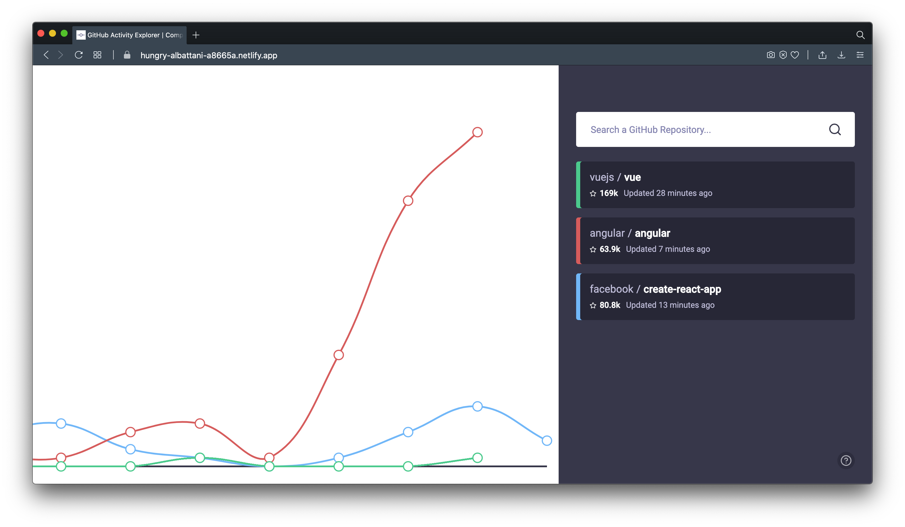
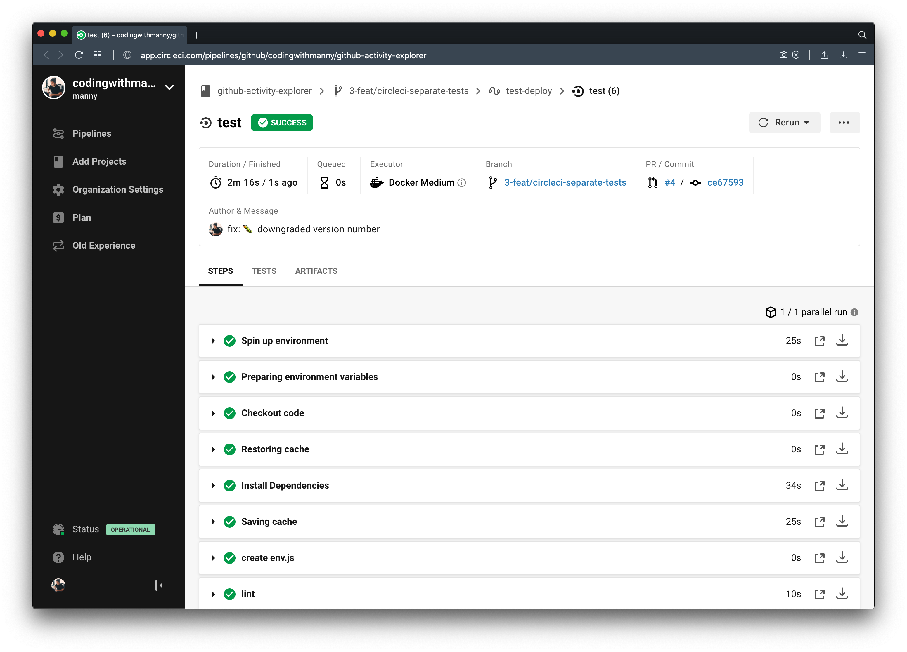
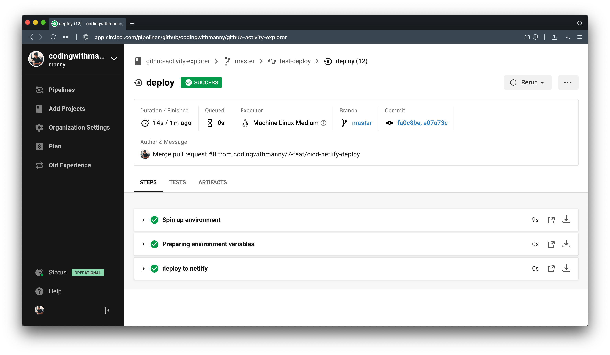
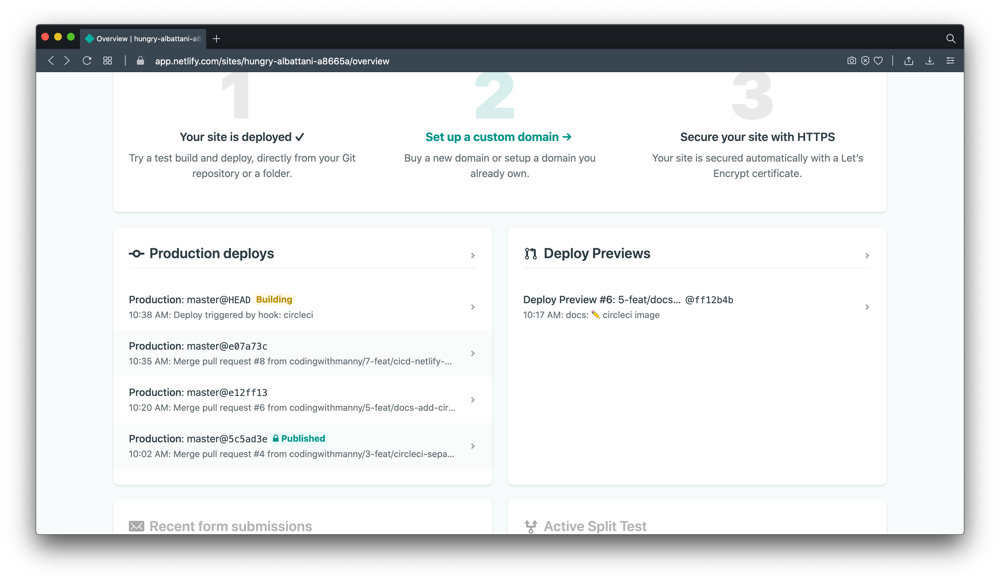
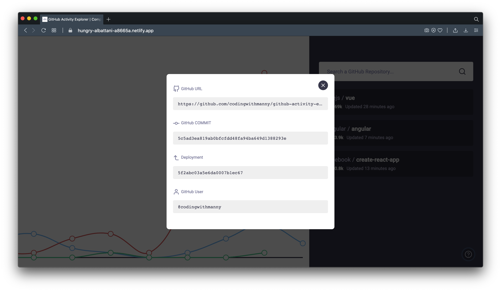
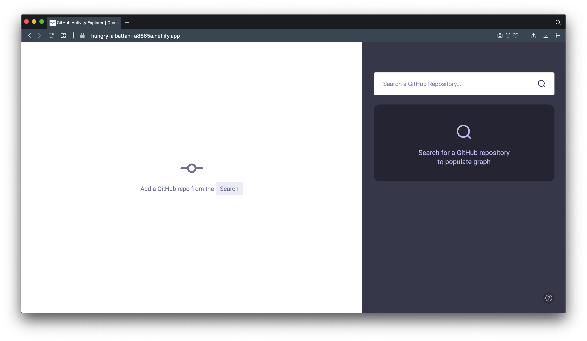

# GitHub Activity Explorer

A SPA React application that allows you to see the commit history for different
GitHub repositories.

Data is 52 weeks from the current date and assumes Monday as starting day of the
week. Each commit history retrieval maxes out at 100 entries from GitHub's API.

**Preview:**
[https://hungry-albattani-a8665a.netlify.app](https://hungry-albattani-a8665a.netlify.app)



---

## TOC

- [Requirements](#requirements)
- [Local Setup](#local-setup)
- [Deployments](#deployments)
- [Tests](#tests)
- [Hooks](#hooks)
- [Development](#development)

---

## Requirements

- NodeJS 12.18.1 or NVM
- Yarn

---

## Local Setup

**Step 1 - Install Correct NodeJS Version**

```bash
nvm install;
```

**Step 2 - Install Depedencies**

```bash
yarn;
```

**Step 3 - Create Env Vars File**

This makes a copy of `public/env.example.js` as `public/env.js`

```bash
yarn start:env;
```

**Step 4 - Start Server**

```bash
yarn start;
```

---

## Deployments

The deployment process is:

1 - PR submission

2 - Validate tests pass with CircleCI

3 - Merge code

4 - Code is autodeployed to Netlify

### Building

Building is meant to test for production locally but builds will be
automatically built with Netlify.

```bash
yarn build;
```

### CircleCI

CircleCI will run everything mentioned in the **Tests** section.

It will run the following tests to validate and do one last check.

```bash
yarn lint;
yarn test:jest;
yarn test:e2e:run;
```



The second phase of CircleCI is to automatically trigger a deployment to Netlify
when all tests have passed.



This will trigger Netlify to start the build and deployment process:



You can also verify the commit deployed on the frontend from:



### Netlify

All deployments are pushed to
[https://hungry-albattani-a8665a.netlify.app](https://hungry-albattani-a8665a.netlify.app).



---

## Tests

**Eslint** - Meant to validate if there are linting issues

**TypeScript Compiler** - Meant to catch type errors

**Jest Snapshots** - Tests that take snapshots of the UI for consistency

**Cypress** - Tests e2e with API to validate functionality

---

## Hooks

There are two hooks

1 - `.huskyrc` which is a githook which runs lint-staged and performs a test on
each commit

2 - `.lintstagedrc` which handles formatting only staged files vs unstaged files
currently being worked on

---

## Development

**Commits**

Should be run with `yarn commit`.

**Logic / Container Components**

Should not be used to handle UI but manipulating and passing data to
presentation components.

**UI / Presentation Components**

Should be used solely for UI and using callback functions defined by container
components.

**Code Snippets**

For code snippets, see `./.vsode/snippets.code-snippets`

You can also create you own snippets to add from here:
[https://snippet-generator.app](https://snippet-generator.app)
